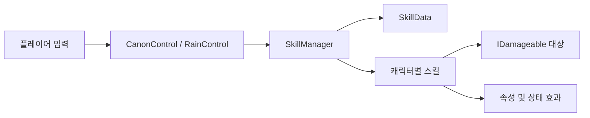
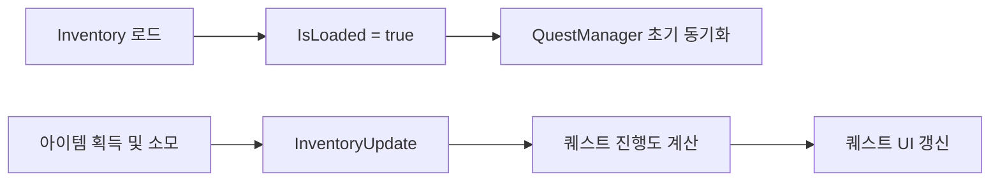

# Magic Celine — Programming Portfolio

Unity로 개발한 개인 2D 액션 RPG 프로젝트입니다.

이 저장소에는 전체 프로젝트 중 제가 직접 구현한 캐릭터 컨트롤,  
전투·스킬, 인벤토리·장비 저장, 퀘스트 시스템의 핵심 코드만 선별했습니다.

> 외부 에셋과 프로젝트 종속 파일은 포함하지 않았기 때문에  
> 전체 게임을 단독으로 실행하기 위한 저장소는 아닙니다.

## 프로젝트 개요

| 항목 | 내용 |
|---|---|
| 프로젝트 | Magic Celine Beta |
| 장르 | 2D 액션 RPG |
| 엔진 | Unity 2022.3.62f2 |
| 언어 | C# |
| 개발 형태 | 개인 프로젝트 |
| 담당 | 기획, 클라이언트 프로그래밍, 시스템 구현 |
| 버전 | Beta 0.9.1 |
| 개발 기간 | 2024. 08. 13 ~ 2025. 11. 11 |
| 예정 | 2026. 09. 28 ~ Beta 0.9.2 -> Steam Release |

## 주요 구현

### 1. 카논·레인 플레이어 컨트롤

카논과 레인의 이동, 입력, 애니메이션, 스킬 사용,  
피격, 넉백, 사망·부활 및 장비 연동을 구현했습니다.

두 캐릭터는 다음 인터페이스를 공통으로 구현합니다.

- `IDamageable`: 피해 처리
- `IKnockbackable`: 넉백 처리
- `ISkillUser`: 캐릭터별 스킬 실행

| 구분 | 카논 | 레인 |
|---|---|---|
| 속성 | 대지 | 물 |
| 전투 특징 | 공격과 디버프 | 회복과 지원 |
| 고유 시스템 | 바위 조각 및 풍화 | 마법 이슬 |
| 메인 컨트롤러 | `CanonControl` | `RainControl` |

#### 카논

카논은 대지 속성 공격과 바위 조각, 풍화 디버프를 사용하는 캐릭터입니다.

- [CanonControl.cs](Source/Character/Canon/CanonControl.cs)
- [EarthElementManager.cs](Source/Character/Canon/EarthElementManager.cs)
- [GroundEx.cs](Source/Character/Canon/GroundEx.cs)
- [Sk_05Whirlwind.cs](Source/Character/Canon/Sk_05Whirlwind.cs)

#### 레인

레인은 마법 이슬을 획득하고 소비하며,  
회복·보호막·물 속성 스킬을 사용하는 캐릭터입니다.

- [RainControl.cs](Source/Character/Rain/RainControl.cs)
- [MagicDewManager.cs](Source/Character/Rain/MagicDewManager.cs)
- [Sk_13WaterBlessing.cs](Source/Character/Rain/Sk_13WaterBlessing.cs)
- [Sk_15Dewshield.cs](Source/Character/Rain/Sk_15Dewshield.cs)

### 2. 데이터 기반 스킬 시스템

스킬의 코드, 요구 레벨, MP 소모량, 재사용 대기시간과  
능력치 보너스를 `SkillData`에 분리했습니다.

`SkillManager`는 선택된 캐릭터의 `ISkillUser` 구현을 통해  
카논과 레인의 스킬을 공통된 방식으로 실행합니다.



관련 코드:

- [ISkillUser.cs](Source/Character/Common/ISkillUser.cs)
- [SkillData.cs](Source/Combat/SkillData.cs)
- [SkillManager.cs](Source/Combat/SkillManager.cs)
- [ElementType.cs](Source/Combat/ElementType.cs)

### 3. 인벤토리 및 장비 저장

PlayerPrefs는 정수, 실수, 문자열과 같은 단순 값만 저장할 수 있어  
ScriptableObject 객체와 Dictionary 형태의 인벤토리를 그대로 저장하기 어려웠습니다.

이를 해결하기 위해 런타임 객체와 저장용 데이터를 분리했습니다.

아이템 코드, 수량, 추가 옵션 코드와 강화 정보를 DTO로 변환하고,  
`JsonUtility`로 직렬화하여 PlayerPrefs에 저장했습니다.

불러올 때는 저장된 식별자를 `ItemDatabase`와 Registry에서 조회하여  
실제 아이템 객체와 장비 슬롯을 복원합니다.


관련 코드:

- [Inventory.cs](Source/DataPersistence/Inventory.cs)
- [InventoryData.cs](Source/DataPersistence/InventoryData.cs)
- [ItemData.cs](Source/DataPersistence/ItemData.cs)
- [Equipment.cs](Source/DataPersistence/Equipment.cs)

### 4. 퀘스트와 인벤토리 동기화

아이템 수집 퀘스트가 인벤토리보다 먼저 초기화되면  
보유 아이템이 0개로 계산되어 진행도가 어긋나는 문제가 있었습니다.

인벤토리에 `IsLoaded` 상태와 `InventoryUpdate` 이벤트를 추가했습니다.  
퀘스트 시스템은 인벤토리 로드가 끝난 후 실제 보유 수량을 기준으로  
목표 진행도를 다시 계산합니다.

아이템 획득이나 소모가 발생하면 이벤트를 통해  
퀘스트 진행도와 UI가 함께 갱신됩니다.



관련 코드:

- [QuestData.cs](Source/Quest/QuestData.cs)
- [QuestDatabase.cs](Source/Quest/QuestDatabase.cs)
- [QuestManager.cs](Source/Quest/QuestManager.cs)

### 5. 보스전 진행 관리

보스전 입장, 생명력 관리, 실패·클리어 처리와  
전투 종료 후 상태 전환을 구현했습니다.

관련 코드:

- [BossRaidManager.cs](Source/Boss/BossRaidManager.cs)
- [MagicLifeManager.cs](Source/Boss/MagicLifeManager.cs)
- [BedrockCreation.cs](Source/Boss/BedrockCreation.cs)

## 폴더 안내

```text
Source/
├─ Character/          캐릭터 컨트롤 및 고유 메커니즘
├─ Combat/             공통 전투·스킬 데이터
├─ DataPersistence/    인벤토리와 장비 저장
├─ Quest/              퀘스트 진행 및 동기화
└─ Boss/               보스전 진행 관리
```

## 코드 열람 안내

이 저장소는 전체 Unity 프로젝트가 아닌 코드 리뷰용 저장소입니다.

씬, 프리팹, 외부 이미지·음원과 상용 플러그인은 포함하지 않았으며,  
일부 코드는 Unity Scene에 배치된 컴포넌트 참조를 전제로 합니다.

## 개선 예정 사항

현재 구현을 기반으로 다음 구조 개선을 계획하고 있습니다.

- 플레이어 컨트롤러의 입력, 이동, 전투, 생명주기 책임 분리
- 카논과 레인의 중복 동작을 공통 컴포넌트로 추출
- 퀘스트 제목 대신 변경되지 않는 고유 ID 사용
- 저장 데이터 버전과 마이그레이션 구조 추가
- 저장·로드 Play Mode 테스트 추가

## Assets and Credits

게임에는 직접 제작한 리소스와 외부 무료 리소스, 생성형 AI 리소스가 함께 사용되었습니다.

이 저장소에는 제가 직접 작성한 핵심 C# 코드만 포함했으며,  
외부 에셋과 플러그인은 라이선스 문제로 제외했습니다.
